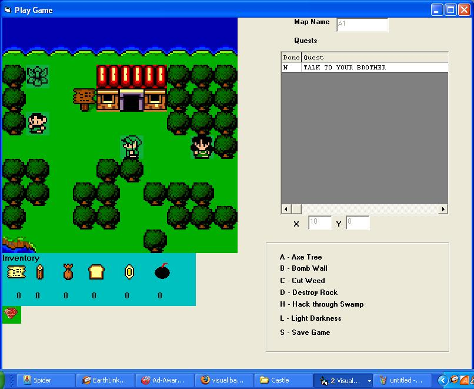



## Quest3 rpg game ver3

### Description

Vote for me and I will send you Quest4

with More Objects, Stores, Caves

Quest3 is a complete rpg Zelda game. Users can play the game or easily create their own game.

The object of the game is to solve different quests. Includes

1) Easy map making, 2)Improved speech

and 3)Ability to use items 4) Hidden rooms

Send me your quests

As you read signs or talk to people, the

response you get will be different

depending on the quest you are on.

More spells -- More Items -- More speech options

*New*

Read thought and much more
 
### More Info
 
All the input to the game are text files that can be edited by using the make option.

             |
---                |---
**Submitted On**   |2005-12-06 19:34:00
**By**             |[Bill Perkett](https://github.com/Planet-Source-Code/PSCIndex/blob/master/ByAuthor/bill-perkett.md)
**Level**          |Intermediate
**User Rating**    |5.0 (45 globes from 9 users)
**Compatibility**  |VB 6\.0
**Category**       |[Games](https://github.com/Planet-Source-Code/PSCIndex/blob/master/ByCategory/games__1-38.md)
**World**          |[Visual Basic](https://github.com/Planet-Source-Code/PSCIndex/blob/master/ByWorld/visual-basic.md)
**Archive File**   |[Quest3\_rpg1954491262005\.zip](https://github.com/Planet-Source-Code/bill-perkett-quest3-rpg-game-ver3__1-62448/archive/master.zip)

